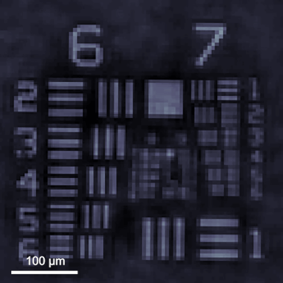
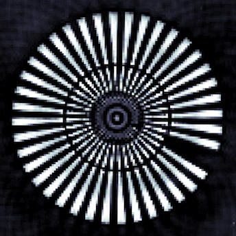
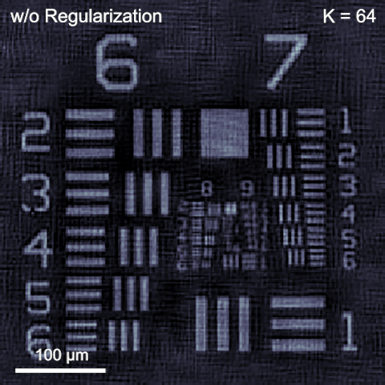

# Algorithms for pixel super-resolution phase retrieval
**Authors:** [Yunhui Gao](https://github.com/Yunhui-Gao) (gyh21@mails.tsinghua.edu.cn) and Liangcai Cao (clc@tsinghua.edu.cn)

## Introduction

**Phase retrieval** and **pixel super-resolution** serve as two essential ingredients for high-fidelity and high-resolution holographic imaging. Here, we combine the two as a unified optimization problem and propose a generalized algorithmic framework for pixel super-resolution phase retrieval.

   

Figure 1. Phase reconstruction of a resolution target.

   

Figure 2. Comparison of reconstruction quality under varying measurement numbers.

Figure 3. Amplitude reconstruction of a biological sample.

## Requirements
Matlab 2019a or newer. Older visions may be sufficient but have not been tested.

## Quick Start
Run `demo_sim.m` with default parameters.

## Theories and References
For algorithm derivation and implementation details, please refer to our papers:

- [Yunhui Gao and Liangcai Cao, "Generalized optimization framework for pixel super-resolution imaging in digital holography," Opt. Express 29, 28805-28823 (2021)](https://doi.org/10.1364/OE.434449).

- [Yunhui Gao, Feng Yang, and Liangcai Cao, "Pixel Super-Resolution Phase Retrieval for Lensless On-Chip Microscopy via Accelerated Wirtinger Flow," Cells 11, 1999 (2022)](https://doi.org/10.3390/cells11131999).