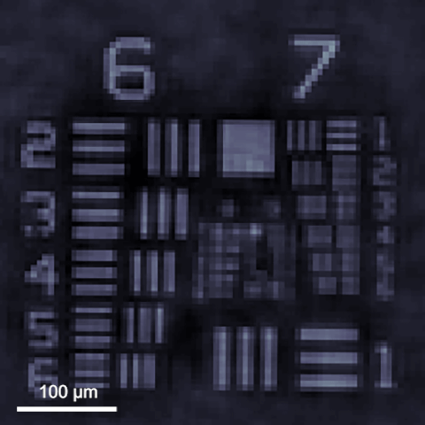
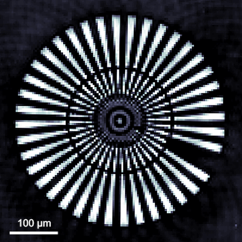
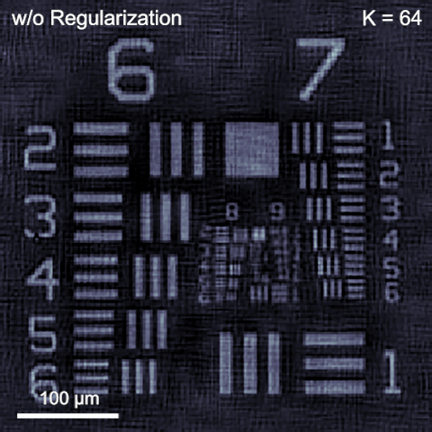
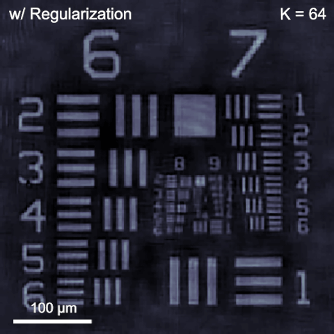
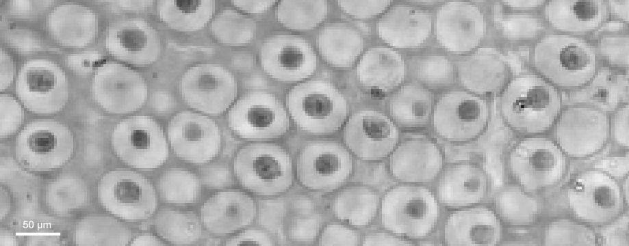

# Algorithms for pixel super-resolution phase retrieval
Authors: **[Yunhui Gao](https://github.com/Yunhui-Gao)** (gyh21@mails.tsinghua.edu.cn) and **[Liangcai Cao](https://scholar.google.com/citations?user=FYYb_-wAAAAJ&hl=en)** (clc@tsinghua.edu.cn)

*[HoloLab](http://www.holoddd.com/), Tsinghua University*

## Introduction

**Phase retrieval** and **pixel super-resolution** (PSR) serve as two essential ingredients for high-fidelity and high-resolution holographic imaging. Here, we combine the two as a unified optimization problem and propose a generalized algorithmic framework for pixel super-resolution phase retrieval.

<p align="left">
  &nbsp;&nbsp; 
</p>

<p align="left"><strong>Figure 1</strong>. PSR phase reconstruction of a resolution target.</p>

<p align="left">
  &nbsp;&nbsp;  
</p>

<p align="left"><strong>Figure 2</strong>. Comparison of phase reconstruction under varying measurement numbers.</p>

<p align="left">

</p>

<p align="left"><strong>Figure 3</strong>. PSR amplitude reconstruction of a biological sample.</p>

## Requirements
Matlab 2019a or newer. Older visions may be sufficient but have not been tested.

## Quick Start
- **PSR phase retrieval using simulated data.** Run [`demo_sim.m`](https://github.com/THUHoloLab/pixel-super-resolution-phase-retrieval/blob/master/main/demo_sim.m) with default parameters.
- **PSR phase retrieval using experimental data.** Run [`demo_exp.m`](https://github.com/THUHoloLab/pixel-super-resolution-phase-retrieval/blob/master/main/demo_exp.m) with default parameters. Experimental data may be obtained from the authors upon reasonable request.

## Accelerated Implementations
The basic demo codes provide intuitive and proof-of-concept implementations for beginners, but are far from efficient. To facilitate faster reconstruction, we provide an optimized version based on CPU or GPU, which can be found at [`demo_sim_fast.m`](https://github.com/THUHoloLab/pixel-super-resolution-phase-retrieval/blob/master/main/demo_sim_fast.m) and [`demo_exp_fast.m`](https://github.com/THUHoloLab/pixel-super-resolution-phase-retrieval/blob/master/main/demo_exp_fast.m) for simulated and experimental data, respectively. To enable GPU usage, simply set `gpu = true;` in the code.

## Theories and References
For algorithm derivation and implementation details, please refer to our papers:

- Yunhui Gao and Liangcai Cao, "Generalized optimization framework for pixel super-resolution imaging in digital holography," Opt. Express 29, 28805-28823 (2021).
[Publication page](https://doi.org/10.1364/OE.434449) | [Paper (PDF)](https://github.com/THUHoloLab/pixel-super-resolution-phase-retrieval/blob/master/docs/oe-29-18-28805.pdf) 

- Yunhui Gao, Feng Yang, and Liangcai Cao, "Pixel Super-Resolution Phase Retrieval for Lensless On-Chip Microscopy via Accelerated Wirtinger Flow," Cells 11, 1999 (2022).
[Publication page](https://doi.org/10.3390/cells11131999) | [Paper (PDF)](https://github.com/THUHoloLab/pixel-super-resolution-phase-retrieval/blob/master/docs/cells-11-13-1999.pdf) | [Supplement (PDF)](https://github.com/THUHoloLab/pixel-super-resolution-phase-retrieval/blob/master/docs/cells-11-13-1999-supplement.pdf).


## Citation

```BibTex
@article{gao2021generalized,
  title={Generalized optimization framework for pixel super-resolution imaging in digital holography},
  author={Gao, Yunhui and Cao, Liangcai},
  journal={Optics Express},
  volume={29},
  number={18},
  pages={28805--28823},
  year={2021},
  publisher={Optica Publishing Group}
}

@article{gao2022pixel,
  title={Pixel super-resolution phase retrieval for lensless on-chip microscopy via accelerated Wirtinger flow},
  author={Gao, Yunhui and Yang, Feng and Cao, Liangcai},
  journal={Cells},
  volume={11},
  number={13},
  pages={1999},
  year={2022},
  publisher={MDPI}
}
```